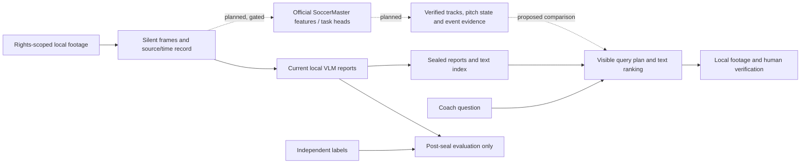

# PlayGround: auditable soccer report retrieval and an evidence-gated evaluation protocol

Internal technical-report candidate, 13 September 2026. Not submitted or promoted. **SYSTEMS GO / SEMANTIC NO-GO.** Authorship, venue and author approval remain unset.

## Abstract

We describe a local system that stores structured video-model reports, searches their text and opens the associated footage for inspection. The current evidence supports system execution and reproducible failure analysis. It does not establish reliable soccer understanding. A historical long-form study returned schema-valid reports for 96 of 96 windows, while six recorded visual spot judgments found zero fully supported reports. We separate this local experiment from the unexecuted official SoccerMaster checkpoint. A frozen general-video harness retains raw responses, request failures, immutable attempts and post-hoc labels, and scores event type and timing through one-to-one matching. A new manifest checker detects declared source-group and duplicate-byte leakage and verifies document hashes without claiming human independence. We specify controlled comparisons, semantic annotation, selective prediction and coach validation needed for a subsequent empirical paper. No Gemini video benchmark, official SoccerMaster inference or coach study has been completed in this package.

## 1. Research question and contribution boundary

Can a language interface help people find and verify soccer evidence more faithfully when it uses measured visual state rather than unsupported narrative alone? Three hypotheses must be tested separately: structured vision evidence improves joint answer-and-evidence correctness; an abstention policy reduces error at useful coverage; and the interface reduces verification time without increasing incorrect acceptance.

The present contribution is an inspectable system and protocol. It is not a new vision backbone, trained-weight improvement, calibrated predictor or demonstrated coaching tool. The broader novelty case remains open. A future paper must compare with prior soccer understanding, retrieval and grounding systems using the claim-level ledger in [the existing outline](../paper-outline.md); selected neighboring papers do not establish a global absence of prior art.

## 2. System

The existing visual path samples ordered silent frames, produces structured language reports, validates their schema and binds outputs to source hashes. The preferred soccer long-form adapter verifies a sealed package and ranks report text with deterministic BM25. A legacy SQLite full-text path is separately labeled. An optional local language model translates the question into search terms; it does not prove the report's soccer semantics. Evidence links identify the source and time span for human inspection.

Solid paths describe implemented components, not validated soccer answers. Dashed paths are proposed. Hashes establish identity; semantic vectors represent similarity. Commentary is a separate post-hoc auxiliary observation, never visual ground truth. Model-written confidence is not calibration.

## 3. Evidence and observed outcomes

| Evidence unit | Observation | Permitted interpretation |
| --- | --- | --- |
| Historical soccer long-form run | 90 contiguous 60-second windows covering two 45-minute halves, plus six stress windows; 96/96 schema-valid | Report generation and packaging executed |
| Historical annotation corroboration | 3/166 mapped annotations and 3/54 mapped predictions matched within a restricted non-one-to-one ±6-second check | Weak coarse corroboration; not conventional event precision/recall |
| Six recorded visual spot judgments | 0 supported, 2 partial, 4 unsupported | Selected qualitative failure evidence; not blinded independent benchmark labels |
| Six generated color-screen fixtures | 6 requests, 5 complete, 1 parse failure, 1 abstention; 3 matched events, 1 unmatched prediction, 3 missed labels | Deterministic scoring arithmetic only; zero real soccer/Gemini calls |
| September 13 audit | 897 tests; six project scripts; 23 finite literal-demo checks passed | Historical engineering validation; current package validation is separately recorded |
| Two historical text-query calls | Completed but introduced unrelated event types | Query faithfulness remains unresolved |
| Official SoccerMaster inventory | Completed with 15 blockers and zero model calls | Exact feasibility boundary, not model execution |

The primary historical result and scope are in [the long-form report](../soccermaster-longform-technical-report-2026-08-27.md), [metrics](../../artifacts/soccermaster-longform-v1/report-metrics.json) and [spot judgments](../../artifacts/soccermaster-longform-v1/spot-check-adjudication.json). The fixture counts and exact seal identities are in [independent rescoring](../../artifacts/soccermaster-audit-20260913/scoring-independent-readback.json). The [audit](../../reports/soccermaster-audit-and-completion-report-2026-09-13.md) binds the 897-test snapshot. Do not merge these rows into one accuracy table.

## 4. Evaluation implementation

The hosted harness freezes prompt, schema, model request settings, input identities, label digests and scoring contract before inference. It retains full redacted raw output, errors and attempt history; primary predictions are sealed before labels/commentary are opened. Retries after label access are disallowed. A pure resume does not create an independent sample.

The scorer requires exact event type, interval IoU ≥0.5 and peak error ≤1 second. Deterministic maximum-cardinality bipartite matching awards each prediction and reference at most one match. It reports request completion, parse failure, abstention, matched/unmatched events and missed labels. Failed requests remain in requested-set accounting. No denominator is silently replaced by the successful subset.

SoccerNet point-label conversion requires a frozen ontology and point-window policy, match/half identity, source hashes, offsets and half-open clip membership. Derived intervals are scoring windows, not annotated event duration. Unmatched predictions are not automatically hallucinations because annotation completeness is unproven. The frozen report schema also cannot distinguish a verified empty-background success from abstention.

The new design checker independently validates declared split/group isolation, duplicate media identities, development exposure and six evidence-document bindings. It is an advisory prerequisite, not wired into provider authorization. A structural pass never verifies labels, legal authority, source-group truth or human independence. See [evaluation protocol](soccermaster-evaluation-protocol-v1-2026-09-13.md).

## 5. Official model integration and related work

SoccerMaster is a soccer-specific vision foundation model with multiple task heads. Its public project describes spatial perception and semantic tasks; it is a candidate structured-evidence source beneath the language layer. This is an integration hypothesis, not a local performance result. [Official project](https://haolinyang-hlyang.github.io/SoccerMaster/).

The arXiv record identifies version 2, revised 7 May 2026, and CVPR 2026 Oral acceptance. Author-reported results are separate from our measurements. [Paper record](https://arxiv.org/abs/2512.11016).

Our metadata-only adapter plans thirty 512×512 RGB uint8 frames and records hashes, sampling order and raw-output provenance. Official normalization/callable, ordered ontology, assets, imports and transport remain unverified or absent. The paper-24 versus historical loader-23 convention must be resolved before label mapping. Two separate 8 GiB GPUs do not imply combined capacity or model fit. See [runbook and gate sequence](soccermaster-reproduction-and-gates-v1-2026-09-13.md).

## 6. Limitations and reproducibility

The selected historical clips are development and diagnostic evidence. Match reuse, post-hoc model selection, changed frame representations, overlapping windows, incomplete labels and small sample size prevent causal rankings and population claims. The recorded six-window visual audit is not a coach study or fresh independent annotation. Readable broadcast identity pixels survived a sampled mask audit. Ball visibility, off-screen players, calibration validity, track continuity, jersey identity, gaze and tactical intent remain unverified.

A clickable timestamp proves a binding, not claim support. Text matching can retrieve a wrong report. Current query expansion can add unrelated events. The timing repair measures interpretation attempts including fallback; it does not recover missing historical timing or measure visual inference, complete search latency or utility.

All new code checks use offline synthetic fixtures. Media, transcripts, raw hosted outputs and identifiable study records stay private; no release rights follow from local access. The publication archive would need a separately reviewed code license, dependency inventory, release-safe examples, exact revisions and an approved data-access statement. Reproduction and integrity receipts do not prove scientific validity.

## 7. Next empirical decision

First complete a rights-safe 6–15-clip stronger-model feasibility run with frozen independent labels. Test the smallest official SoccerMaster path only after its source, dependency and contract gates pass. Then run the controlled evidence, replay-gate and retrieval studies defined in the protocol. Author review, independent Luna review, later Terra inspection and external release approval remain required. Current evidence supports an honest technical report and failure case study; an empirical effectiveness paper remains incomplete.
